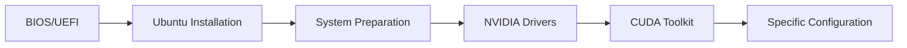

# Improved Guide for Setting Up Ubuntu Workstations with NVIDIA GPU

> **Last updated:** May 7, 2026

---

## Index

* [1. Pre-Installation Requirements](#1-pre-installation-requirements)
* [2. Ubuntu System Installation](#2-ubuntu-system-installation)
* [3. Initial Ubuntu System Preparation](#3-initial-ubuntu-system-preparation)
* [4. Installing NVIDIA Drivers on Ubuntu](#4-installing-nvidia-drivers-on-ubuntu)
* [5. Installing CUDA Toolkit](#5-installing-cuda-toolkit)
* [6. Specific Setup for Compression Workstations](#6-specific-setup-for-compression-workstations)
* [7. Specific Setup for Analytics Workstations](#7-specific-setup-for-analytics-workstations)
* [8. Managing the Graphical Interface](#8-managing-the-graphical-interface)
* [9. Common Network Issues with New Motherboards](#9-common-network-issues-with-new-motherboards)
* [10. Wake-on-LAN (WOL): Windows to Windows and Ubuntu to Windows](#10-wake-on-lan-wol-windows-to-windows-and-ubuntu-to-windows)
* [11. Post-Installation Script (Optional)](#11-post-installation-script-optional)
* [12. Doctor Verification Scripts](#12-doctor-verification-scripts)
* [13. Security Best Practices (Optional)](#13-security-best-practices-optional)
* [FAQ: Frequently Asked Questions](#faq-frequently-asked-questions)
* [Annex A: Identifying NVIDIA GPUs](#annex-a-identifying-nvidia-gpus)
* [Annex B: Compatibility Verification](#annex-b-compatibility-verification)

---

> **Welcome!** This improved guide will help you install and configure Ubuntu with an NVIDIA GPU, optimizing each step and explaining the reasoning behind every action. All original commands and procedures are preserved, with added explanations, tips, and warnings for clarity.

---

## Visual Process Overview



---

## 1. Pre-Installation Requirements

### Before touching the machine

Confirm these points before installing Ubuntu:

| You need | Why |
|----------|-----|
| USB drive of 8 GB or more | To boot the Ubuntu installer. |
| Ubuntu Desktop LTS ISO image | This is the file copied to the USB drive. This guide uses Ubuntu Desktop 24.04 LTS as reference. |
| Backup of important data | The installation can erase the entire disk. |
| Internet access | Helps install updates and packages during the process. |
| Workstation type defined | Decide if the machine will be used for **compression/data** or **analytics**. |

> **Important alert:** If the machine has files you cannot lose, back them up before continuing. The simple installation path uses "Erase disk and install Ubuntu".

### Quick decision

- If the machine will be used by a person and has a screen, install **Ubuntu Desktop**.
- If the machine will be managed remotely, you can still start with **Ubuntu Desktop** and disable the graphical interface later.
- If you need dual boot with Windows, do not use the simple path in this section; it requires manual partitioning.

---

## 2. Ubuntu System Installation

This section leaves Ubuntu installed and ready for initial preparation. Follow the steps in order.

### Step 1: Download Ubuntu

1. Go to [https://ubuntu.com/download/desktop](https://ubuntu.com/download/desktop).
2. Download the **Ubuntu Desktop LTS** version indicated for your installation.
3. Save the `.iso` file somewhere easy to find, for example `Downloads`.

### Step 2: Create the installation USB

The simplest option is to use a graphical tool:

1. Download BalenaEtcher from [https://etcher.balena.io/](https://etcher.balena.io/) or Ventoy from [https://www.ventoy.net/](https://www.ventoy.net/).
2. Connect the USB drive.
3. Select the Ubuntu ISO.
4. Select the correct USB drive.
5. Start the process and wait until it finishes.

> **Careful:** The tool will erase the USB drive. Check twice that you selected the correct drive.

### Step 3: Enter BIOS/UEFI

1. Shut down the machine.
2. Connect the USB drive.
3. Turn on the machine and press the BIOS key several times.

Common keys: `DEL`, `F2`, `F8`, `F10`, `F11`, `F12`, or `ESC`.

Common examples:

- ASUS usually uses `DEL`.
- MSI usually uses `DEL` or `F2`.
- Gigabyte usually uses `DEL`.

If it does not enter BIOS, restart and try another key.

### Step 4: Adjust BIOS/UEFI

Inside BIOS, change only what is needed:

| Option | Recommended value | Reason |
|--------|-------------------|--------|
| Secure Boot | Disabled | Prevents conflicts with proprietary NVIDIA drivers. |
| Boot Priority | USB first | Allows the Ubuntu installer to boot. |
| AC Power Loss | Always On, if it is a remote workstation | The machine powers back on after a power outage. |

Save changes with `F10` or with the **Save and Exit** option.

### Step 5: Boot from the USB

1. After restarting, choose the USB drive as the boot device.
2. Select **Try or Install Ubuntu**.
3. Wait for the installer to load.

If a black screen appears before entering the installer, use `nomodeset`:

1. In the boot menu, press `E`.
2. Find the line that starts with `linux`.
3. Add `nomodeset` at the end of that line.
4. Press `F10` to continue.

**Example edited line:**
```
linux /boot/vmlinuz-... nomodeset ---
```

### Step 6: Install Ubuntu with simple options

In the installer, use this selection:

| Screen | Recommended selection |
|--------|-----------------------|
| Language | **English**, to keep standard folder names like `Desktop` and `Downloads`. |
| Keyboard | Spanish or the physical keyboard layout. |
| Network | Connected to the internet if possible. |
| Installation type | Normal installation. |
| Additional software | Install updates if the installer offers them. If "third-party software" mixes graphics and Wi-Fi, leave it unchecked; network drivers are reviewed in section 3 and NVIDIA is installed later with `.run`. |
| Disk | **Erase disk and install Ubuntu**, only if you already backed everything up. |
| User | Create a normal user with a strong password. |
| Time zone | Select the correct time zone. |

> **Important alert:** `Erase disk and install Ubuntu` erases the selected disk. Do not choose this option if you need to keep Windows, partitions, or files.

The installation can take between 15 and 30 minutes. When it finishes, the installer will ask you to restart.

### Step 7: First boot

1. When Ubuntu asks, remove the USB drive.
2. Press `Enter` if the restart message appears.
3. Log in with the user you created.
4. Open a terminal with `Ctrl+Alt+T`.
5. Run these basic checks:

```bash
lsb_release -a
ping -c 4 google.com
df -h
```

Expected result:

- `lsb_release -a` shows Ubuntu.
- `ping` receives replies.
- `df -h` shows available disk space.

### If something fails during installation

| Problem | What to try first |
|---------|-------------------|
| The USB does not appear at boot | Recreate the USB, try another USB port, or check boot order. |
| Black screen before the installer | Boot with `nomodeset`. |
| The installer freezes | Restart, disable overclock in BIOS, and try again. |
| You cannot disable Secure Boot | Check the motherboard manual or search the exact BIOS model. |
| Error erasing or preparing the disk | Use the simple option if you do not need dual boot; if you need dual boot, stop and prepare partitions manually. |
| No internet | Continue the installation and solve networking later in the network issues section. |

---

## 3. Initial Ubuntu System Preparation

This section prepares Ubuntu to install the official NVIDIA driver with a `.run` file, which is the main path in this manual. Do not install the NVIDIA driver or CUDA yet; that comes in the next sections.

### Rule for this section

- We install updates, build tools, kernel headers, and base utilities.
- We set the graphical environment to Xorg to avoid NVIDIA conflicts.
- We can install **Ethernet/Wi-Fi** firmware or drivers if networking does not work.
- We do not use `ubuntu-drivers`, "Additional Drivers", or APT repositories to install NVIDIA.
- We do not run any `.run` installer yet.

### Step 1: Open a terminal

Press `Ctrl+Alt+T`.

If the machine asks for a password when using `sudo`, type your user password. The terminal will not show characters while you type; that is normal.

### Step 2: Check internet and network drivers

Before updating Ubuntu, confirm the machine has networking:

```bash
nmcli device status
ping -c 4 archive.ubuntu.com
```

Expected result:

- `nmcli` shows at least one connected interface.
- `ping` receives replies.

If **Ethernet or Wi-Fi does not appear**, identify the hardware:

```bash
lspci -nn | grep -Ei 'ethernet|network|wireless|wifi'
lsusb
```

Use that output to decide:

| Case | What to do |
|------|------------|
| Ethernet works, Wi-Fi does not | Connect an Ethernet cable and continue with the guide. Wi-Fi can be fixed later. |
| Wi-Fi works, Ethernet does not | Connect through Wi-Fi and continue with the guide. Ethernet can be fixed later. |
| Neither Ethernet nor Wi-Fi works | Use temporary internet through USB tethering from a phone or a Linux-compatible USB Ethernet/Wi-Fi adapter. |
| Broadcom Wi-Fi appears | With temporary internet, install `bcmwl-kernel-source`. |
| Intel/Realtek Wi-Fi appears but does not connect | With temporary internet, install or update `linux-firmware`. |
| Realtek RTL8125 Ethernet appears | If networking does not come up, review section 9 after getting temporary internet. |

With temporary internet, install base network firmware:

```bash
sudo apt update
sudo apt install -y linux-firmware
sudo reboot
```

> **Important:** It is allowed to use "Additional Drivers" for network drivers such as Broadcom Wi-Fi. Do not select NVIDIA drivers there; NVIDIA will be installed in section 4 with `.run`.

### Step 3: Update Ubuntu and reboot

First update the full system:

```bash
sudo apt update
sudo apt upgrade -y
```

When it finishes, reboot:

```bash
sudo reboot
```

After the reboot, open the terminal again.

### Step 4: Install tools required for `.run`

The NVIDIA `.run` installer needs to compile kernel modules. For that, it requires headers, DKMS, and build tools.

```bash
sudo apt install -y build-essential dkms linux-headers-$(uname -r) linux-headers-generic pkg-config gcc g++ make
sudo apt install -y libglvnd-dev libgl1-mesa-dev libegl1-mesa-dev libgles2-mesa-dev libx11-dev libxmu-dev libxi-dev libglu1-mesa-dev libgstreamer1.0-dev libgstreamer-plugins-base1.0-dev
sudo apt install -y ca-certificates curl wget git vim nano mesa-utils inxi net-tools openssh-server ufw dnsutils htop ncdu tree traceroute nmap lm-sensors neofetch
```

### Step 5: Disable Wayland and use Xorg

For this manual, we use Xorg because it is usually more predictable with NVIDIA drivers installed through `.run`.

Edit the GDM3 configuration:

```bash
sudo nano /etc/gdm3/custom.conf
```

Find this line:

```ini
#WaylandEnable=false
```

Leave it like this, without `#` at the beginning:

```ini
WaylandEnable=false
```

Save with `Ctrl+O`, press `Enter`, and exit with `Ctrl+X`.

Reboot to apply the change:

```bash
sudo reboot
```

### Step 6: Prepare remote access if you will use it

If the machine will be managed from another computer, enable SSH and allow it through the firewall:

```bash
sudo systemctl enable --now ssh
sudo ufw allow ssh
sudo ufw --force enable
```

If you will not use remote access, you can skip this step.

### Step 7: Apply adjustments for your Ubuntu version

First check your version:

```bash
lsb_release -rs
```

For **Ubuntu 22.04 LTS**, install GCC/G++ 12 if you will use CUDA versions that require it:

```bash
sudo apt install -y gcc-12 g++-12
sudo update-alternatives --install /usr/bin/gcc gcc /usr/bin/gcc-12 120
sudo update-alternatives --install /usr/bin/g++ g++ /usr/bin/g++-12 120
```

For **Ubuntu 24.04 LTS**, install `libtinfo5` only if CUDA or an older tool requests it:

```bash
wget http://security.ubuntu.com/ubuntu/pool/universe/n/ncurses/libtinfo5_6.3-2ubuntu0.1_amd64.deb
sudo apt install ./libtinfo5_6.3-2ubuntu0.1_amd64.deb
rm libtinfo5_6.3-2ubuntu0.1_amd64.deb
```

If you do not know whether you need it, you can leave it for later. It does not block NVIDIA driver installation.

### Step 8: Verify the preparation is ready

Run:

```bash
gcc --version
dkms status
ls /usr/src/linux-headers-$(uname -r)
echo $XDG_SESSION_TYPE
```

Expected result:

- `gcc --version` shows an installed version.
- `dkms status` does not show an error, although it may not list anything yet.
- `ls /usr/src/linux-headers-$(uname -r)` shows kernel files.
- `echo $XDG_SESSION_TYPE` should show `x11` if you are in a graphical session.

### If something fails during preparation

| Problem | What to try first |
|---------|-------------------|
| `apt update` fails | Check internet with `ping -c 4 archive.ubuntu.com`. |
| Wi-Fi does not appear | Use Ethernet or temporary USB tethering and install `linux-firmware`; if it is Broadcom, install `bcmwl-kernel-source`. |
| Ethernet does not appear | Use Wi-Fi, USB tethering, or a temporary USB adapter; then check the chip with `lspci -nn`. |
| Packages do not install | Run `sudo apt --fix-broken install` and repeat the command. |
| Kernel headers are missing | Run `sudo apt install -y linux-headers-$(uname -r) linux-headers-generic`. |
| `echo $XDG_SESSION_TYPE` shows `wayland` | Check `/etc/gdm3/custom.conf`, confirm `WaylandEnable=false`, and reboot. |
| SSH does not connect | Check the machine IP with `ip a` and firewall status with `sudo ufw status`. |
| You do not know whether an NVIDIA driver is already installed | Do not install over it. Section 4 will clean up before the `.run`. |

---

## 4. Installing NVIDIA Drivers on Ubuntu

This section installs the official NVIDIA driver using the `.run` file. This is the main method in this manual.

### Before starting

Confirm that you already completed section 3:

- Ubuntu is updated.
- Networking works.
- `gcc`, `dkms`, and kernel headers are installed.
- Secure Boot is disabled in BIOS/UEFI.
- You did not install NVIDIA through "Additional Drivers", `ubuntu-drivers`, or APT.

> **Important:** Do not mix methods. If you install NVIDIA with `.run`, do not later install `nvidia-driver-XXX`, `nvidia-open`, or `cuda-drivers` with APT on top of the same installation.

### Recommended branch: 580.x.x

For these workstations, we use the **R580 / 580.x.x** family because it has been the most stable in our testing. When downloading the driver, look for the newest available 580 version for your GPU.

Do not switch to another driver family only because a newer version exists. Change branches only for a concrete reason: support for a new GPU, a critical bug fix, or internal validation.

### Step 1: Identify the NVIDIA GPU

Run:

```bash
lspci -nn | grep -Ei 'nvidia|vga|3d|display'
```

Example:

```
01:00.0 VGA compatible controller: NVIDIA Corporation GA104 [GeForce RTX 3070] (rev a1)
```

If no NVIDIA GPU appears:

- Check that the GPU is physically installed correctly.
- Check BIOS/UEFI.
- Do not continue with the `.run` until the system detects the GPU.

### Step 2: Download the `.run` driver

1. Go to [https://www.nvidia.com/drivers/](https://www.nvidia.com/drivers/).
2. Select your exact GPU model.
3. Select **Linux 64-bit** as the operating system.
4. Look for a **580.x.x** version.
5. Download the `.run` file.
6. Save it in `Downloads`.

If NVIDIA offers several options, prefer the newest 580 family version compatible with your GPU. If the website does not offer 580 for that model, stop and review compatibility before installing another family.

In the terminal, confirm the file exists:

```bash
cd ~/Downloads
ls NVIDIA-Linux-x86_64-*.run
mv NVIDIA-Linux-x86_64-*.run NVIDIA-driver.run
```

If `mv` fails because there is more than one `.run`, leave only the driver you will install in `Downloads` and repeat the command.

If NVIDIA publishes a checksum for your download, compare it:

```bash
sha256sum NVIDIA-driver.run
```

### Step 3: Clean previous NVIDIA installations

On a freshly installed machine there should not be much to clean, but this avoids mixing methods:

```bash
dpkg -l | grep -Ei 'nvidia|cuda-drivers' || true
sudo apt purge -y '^nvidia-.*' '^libnvidia-.*' '^cuda-drivers.*' '^nvidia-open.*'
sudo apt autoremove -y
```

If the command removes anything, reboot before continuing:

```bash
sudo reboot
```

### Step 4: Disable Nouveau and enter text mode

`nouveau` is the open driver that Ubuntu may load before NVIDIA is installed. The `.run` installer needs it inactive.

```bash
printf 'blacklist nouveau\noptions nouveau modeset=0\n' | sudo tee /etc/modprobe.d/blacklist-nouveau.conf
sudo update-initramfs -u
sudo systemctl set-default multi-user.target
sudo reboot
```

After reboot you will see a text console. Log in with your user and verify:

```bash
lsmod | grep nouveau
```

Expected result: no output. If `nouveau` appears, do not continue; repeat this step and reboot.

### Step 5: Run the `.run` installer

From the text console:

```bash
cd ~/Downloads
chmod +x NVIDIA-driver.run
sudo ./NVIDIA-driver.run --dkms
```

Answer like this if the installer asks:

| Installer question | Recommended answer |
|--------------------|--------------------|
| `The distribution-provided pre-install script failed...` | `Yes`, continue. On Ubuntu this is often a warning. |
| Register modules with DKMS | `Yes`. This helps when the kernel changes. |
| Module type: Open/MIT-GPL or Proprietary | For RTX 20/30/40/50 or newer, use Open/MIT-GPL if shown. For older pre-Turing GPUs, use Proprietary. If unsure, leave the option recommended by the installer. |
| 32-bit libraries | `No`, unless you need old 32-bit applications. |
| Run `nvidia-xconfig` | `No`. |

If it fails, review:

```bash
less /var/log/nvidia-installer.log
```

### Step 6: Return to graphical mode and reboot

When the installer finishes successfully:

```bash
sudo systemctl set-default graphical.target
sudo reboot
```

### Step 7: Verify the NVIDIA driver

After reboot, open a terminal and run:

```bash
nvidia-smi
cat /proc/driver/nvidia/version
dkms status | grep -i nvidia
```

Expected result:

- `nvidia-smi` shows the GPU.
- `/proc/driver/nvidia/version` shows the loaded version.
- `dkms status` shows the NVIDIA module installed for the current kernel.

You can also save a machine summary:

```bash
nvidia-smi --query-gpu=name,driver_version,memory.total --format=csv
```

### If you need to uninstall the `.run`

Use this only if the driver was installed incorrectly or you need to start over:

```bash
sudo systemctl set-default multi-user.target
sudo reboot
```

Then log in through the console and run:

```bash
sudo nvidia-uninstall
sudo rm -f /etc/modprobe.d/blacklist-nouveau.conf
sudo update-initramfs -u
sudo systemctl set-default graphical.target
sudo reboot
```

### If something fails with NVIDIA

| Problem | What to check first |
|---------|---------------------|
| `nvidia-smi` says it failed | Check Secure Boot, reboot, and inspect `/var/log/nvidia-installer.log`. |
| The installer says `nouveau` is active | Repeat step 4, run `sudo update-initramfs -u`, and reboot. |
| Module compilation fails | Check `gcc --version`, `dkms status`, and `ls /usr/src/linux-headers-$(uname -r)`. |
| Black screen after reboot | Enter recovery mode or TTY, run `sudo nvidia-uninstall`, and retry. |
| It broke after a kernel update | Install headers for the new kernel and run `sudo dkms autoinstall`. |
| You installed through APT by mistake | Purge NVIDIA packages with APT, reboot, and repeat this section from step 3. |

Official references:

- [NVIDIA Driver Installation Guide](https://docs.nvidia.com/datacenter/tesla/driver-installation-guide/)
- [NVIDIA Driver Downloads](https://www.nvidia.com/drivers/)

---

## 5. Installing CUDA Toolkit

> **Note:** This section installs CUDA Toolkit only, using NVIDIA's `.deb (local)` installer. It assumes the NVIDIA driver is already installed via `.run` (section 4). **Do not install the `cuda` or `cuda-drivers` meta-packages**: both pull in NVIDIA's packaged driver and would override your `.run` install. Install only `cuda-toolkit-XX-Y`.

> **Version pinned by this manual:** **CUDA 13.0** (compatible with the 580.x.x driver branch). If you switch versions, adjust the commands and paths (`13-0` → `XX-Y`, `cuda-13.0` → `cuda-XX.Y`).

### Before starting

Confirm:

- NVIDIA `.run` driver 580.x.x already installed (section 4) and `nvidia-smi` works.
- Internet available.
- No previous CUDA install via APT, snap, or `.run` from another version.

### Step 1: CUDA repository pin

The pin ensures correct priority when packages overlap with other repos:

```bash
wget https://developer.download.nvidia.com/compute/cuda/repos/ubuntu2404/x86_64/cuda-ubuntu2404.pin
sudo mv cuda-ubuntu2404.pin /etc/apt/preferences.d/cuda-repository-pin-600
```

### Step 2: Download and install the local CUDA 13.0 repository

```bash
wget https://developer.download.nvidia.com/compute/cuda/13.0.0/local_installers/cuda-repo-ubuntu2404-13-0-local_13.0.0-580.65.06-1_amd64.deb
sudo dpkg -i cuda-repo-ubuntu2404-13-0-local_13.0.0-580.65.06-1_amd64.deb
sudo cp /var/cuda-repo-ubuntu2404-13-0-local/cuda-*-keyring.gpg /usr/share/keyrings/
sudo apt-get update
```

> **Important:** The `.deb` filename changes with each release (`13.0.0-580.65.06-1` here). Before installing, go to [https://developer.nvidia.com/cuda-downloads](https://developer.nvidia.com/cuda-downloads), choose Linux > x86_64 > Ubuntu > 24.04 > deb (local), and copy the exact commands NVIDIA shows.

### Step 3: Install the toolkit only (no driver)

```bash
sudo apt-get -y install cuda-toolkit-13-0
```

> **Do not run** `sudo apt-get install cuda` or `sudo apt-get install cuda-drivers`. Those packages install NVIDIA's packaged driver and break the `.run` 580.x.x driver from section 4.

**Verification (optional):**
```bash
dpkg -l | grep cuda-toolkit-13-0
ls /usr/local/cuda-13.0/bin/nvcc
```

### Step 4: Configure PATH and LD_LIBRARY_PATH

Edit `~/.bashrc`:

```bash
nano ~/.bashrc
```

Add at the end:

```bash
export PATH=/usr/local/cuda-13.0/bin${PATH:+:${PATH}}
export LD_LIBRARY_PATH=/usr/local/cuda-13.0/lib64${LD_LIBRARY_PATH:+:${LD_LIBRARY_PATH}}
```

Save and reload:

```bash
source ~/.bashrc
```

**Verification:**
```bash
which nvcc                # /usr/local/cuda-13.0/bin/nvcc
nvcc --version            # release 13.0
nvidia-smi                # 580.x.x driver still loaded
```

### If you need to uninstall CUDA Toolkit

```bash
sudo apt-get -y remove --purge 'cuda-toolkit-13-0' 'cuda-*-13-0'
sudo apt-get -y autoremove
sudo rm -rf /usr/local/cuda-13.0
sudo rm -f /etc/apt/preferences.d/cuda-repository-pin-600
sudo rm -f /etc/apt/sources.list.d/cuda-ubuntu2404-13-0-local.list
sudo apt-get update
```

This does not touch the NVIDIA `.run` driver.

### CUDA Troubleshooting

- **`nvcc: command not found`:** check `~/.bashrc` has the `export PATH=...` line and that you ran `source ~/.bashrc`.
- **`apt` wants to install `nvidia-driver-*` or `cuda-drivers-*`:** you are calling the `cuda` meta-package. Use only `cuda-toolkit-13-0`.
- **Driver stopped working after installing CUDA:** you installed `cuda` or `cuda-drivers`. Purge with the uninstall section, reinstall the `.run` driver (section 4), and reinstall only `cuda-toolkit-13-0`.
- **`nvidia-smi` and `nvcc` report different versions:** this is normal. `nvidia-smi` shows the driver version, `nvcc` shows the toolkit version.

---

## 6. Specific Setup for Compression Workstations

> **Note:** This section installs tools for compression/data workstations, assuming Ubuntu 24.04.1 LTS with CUDA/drivers installed. Tools are optional; install only what's necessary. Check versions on official sites.

### Installing MongoDB (NoSQL Database)

#### Step 1: Add Repository
Import GPG key:
```bash
curl -fsSL https://www.mongodb.org/static/pgp/server-8.0.asc | sudo gpg --dearmor -o /usr/share/keyrings/mongodb-server-8.0.gpg
```

Add repository (adjust `jammy` to `noble` if using Ubuntu 24.04):
```bash
echo "deb [ arch=amd64,arm64 signed-by=/usr/share/keyrings/mongodb-server-8.0.gpg ] https://repo.mongodb.org/apt/ubuntu noble/mongodb-org/8.0 multiverse" | sudo tee /etc/apt/sources.list.d/mongodb-org-8.0.list
```

#### Step 2: Install MongoDB
```bash
sudo apt-get update
sudo apt-get install -y mongodb-org
```

#### Step 3: Start and Enable Service
```bash
sudo systemctl start mongod
sudo systemctl enable mongod
```

**Verification:**
```bash
sudo systemctl status mongod
mongosh --eval "db.runCommand('ping')"
# Should show "ok": 1
```

### Installing MongoDB Compass (GUI for MongoDB)

#### Step 1: Download and Install
Download from [https://www.mongodb.com/try/download/compass](https://www.mongodb.com/try/download/compass):
```bash
wget https://downloads.mongodb.com/compass/mongodb-compass_1.43.4_amd64.deb
sudo apt install -y ./mongodb-compass_1.43.4_amd64.deb
```

If dependencies missing:
```bash
sudo apt --fix-broken install
```

#### Step 2: Run Compass
```bash
mongodb-compass &
```

**Verification:** Open the app and connect to `mongodb://localhost:27017`.

**Uninstallation (optional):**
```bash
sudo apt remove -y mongodb-compass
```

### Installing EMQX (MQTT Broker)

#### Step 1: Install from Repository
```bash
curl -sL https://assets.emqx.com/scripts/install-emqx-deb.sh | sudo bash
sudo apt-get install -y emqx
```

#### Step 2: Start and Enable
```bash
sudo systemctl start emqx
sudo systemctl enable emqx
```

**Verification:**
```bash
sudo systemctl status emqx
# Dashboard at http://localhost:18083 (user: admin, pass: public)
```

### Installing Golang

#### Step 1: Install with Snap
```bash
sudo snap install go --classic
```

**Verification:**
```bash
go version
# Should show installed version
```

### Installing Visual Studio Code

#### Step 1: Install with Snap
```bash
sudo snap install code --classic
```

**Verification:**
```bash
code --version
# Should show version
```

### Installing GStreamer and Plugins

#### Step 1: Install Plugins
```bash
sudo apt-get install -y gstreamer1.0-plugins-base gstreamer1.0-plugins-good gstreamer1.0-plugins-bad gstreamer1.0-plugins-ugly gstreamer1.0-libav gstreamer1.0-tools gstreamer1.0-x gstreamer1.0-alsa gstreamer1.0-gl gstreamer1.0-gtk3 gstreamer1.0-qt5 gstreamer1.0-pulseaudio gstreamer1.0-rtsp
```

**Verification:**
```bash
gst-inspect-1.0 rtspclientsink
gst-inspect-1.0 nvh264enc
# Should show plugin info
```

### Installing Angry IP Scanner

#### Step 1: Download and Install
Download from [https://github.com/angryip/ipscan/releases](https://github.com/angryip/ipscan/releases):
```bash
wget https://github.com/angryip/ipscan/releases/download/3.9.1/ipscan_3.9.1_amd64.deb
sudo apt install -y ./ipscan_3.9.1_amd64.deb
```

**Verification:** Run `ipscan` from terminal or menu.

### Installing AnyDesk (Remote Support)

#### Step 1: Add Repository and Install
```bash
sudo apt update
sudo apt install -y ca-certificates curl apt-transport-https
sudo install -m 0755 -d /etc/apt/keyrings
sudo curl -fsSL https://keys.anydesk.com/repos/DEB-GPG-KEY -o /etc/apt/keyrings/keys.anydesk.com.asc
sudo chmod a+r /etc/apt/keyrings/keys.anydesk.com.asc
echo "deb [signed-by=/etc/apt/keyrings/keys.anydesk.com.asc] https://deb.anydesk.com all main" | sudo tee /etc/apt/sources.list.d/anydesk-stable.list > /dev/null
sudo apt update
sudo apt install -y anydesk
```

#### Step 2: Configure Firewall
```bash
sudo ufw allow 80/tcp
sudo ufw allow 443/tcp
sudo ufw allow 6568/tcp
sudo ufw allow 50001:50003/udp
```

**Verification:** Run `anydesk` and note the ID.

### Installing RustDesk (Remote Support Alternative)

#### Step 1: Download and Install
Download from [https://github.com/rustdesk/rustdesk/releases](https://github.com/rustdesk/rustdesk/releases):
```bash
wget https://github.com/rustdesk/rustdesk/releases/download/1.2.3/rustdesk-1.2.3-x86_64.deb
sudo apt install -y ./rustdesk-1.2.3-x86_64.deb
```

**Verification:** Run `rustdesk` and configure ID/password.

### Configuring Ports for Compression Workstations (Optional)
If you enabled UFW in section 3, open necessary ports for apps to function correctly. If not using firewall, skip this section.

| Application | Ports | Protocol | Command to Open (Optional) |
|------------|---------|-----------|-------------------------------|
| MongoDB | 27017 | TCP | `sudo ufw allow 27017/tcp` |
| EMQX MQTT | 1883 | TCP | `sudo ufw allow 1883/tcp` |
| EMQX Dashboard | 18083 | TCP | `sudo ufw allow 18083/tcp` |
| GStreamer RTSP | 554 | TCP/UDP | `sudo ufw allow 554/tcp && sudo ufw allow 554/udp` |
| AnyDesk | 80, 443, 6568 | TCP | `sudo ufw allow 80/tcp && sudo ufw allow 443/tcp && sudo ufw allow 6568/tcp` |
| AnyDesk (UDP) | 50001-50003 | UDP | `sudo ufw allow 50001:50003/udp` |
| RustDesk | Dynamic (check logs) | TCP/UDP | Configure as needed |
| SSH (if using) | 22 (or custom) | TCP | `sudo ufw allow ssh` |

**General verification (optional):**
```bash
sudo ufw status
netstat -tlnp | grep LISTEN  # Lists open ports
```

**Tips (optional):**
- For remote access, open only necessary ports and from specific IPs: `sudo ufw allow from <IP> to any port 27017`.
- If using VPN, adjust rules.
- Check app logs for additional ports (e.g., `sudo journalctl -u emqx`).

### General Tips
- Check services: `sudo systemctl status <service>`.
- Configure unique passwords for remote access.
- Review plugins: Use `gst-inspect-1.0` for GStreamer.

### Troubleshooting
- **MongoDB not starting:** Check logs: `sudo journalctl -u mongod`.
- **EMQX failing:** Verify ports: `netstat -tlnp | grep 1883`.
- **GStreamer plugins missing:** `sudo apt install gstreamer1.0-plugins-*`.
- **AnyDesk/RustDesk not connecting:** Temporarily disable firewall for testing.

> **Additional Resources:**
> * [MongoDB Docs](https://www.mongodb.com/docs/)
> * [EMQX Docs](https://www.emqx.io/docs/)
> * [GStreamer Docs](https://gstreamer.freedesktop.org/documentation/)

---

## 7. Specific Setup for Analytics Workstations

> **Note:** This section installs tools for analytics/machine learning, assuming Ubuntu 24.04.1 LTS with CUDA installed. Install only what's necessary.

### Configuring MongoDB (Database and User)

#### Step 1: Access Console
```bash
mongosh
```

#### Step 2: Create Database and User
Replace placeholders:
```javascript
use DATABASE_NAME
db.createUser({
  user: "USERNAME",
  pwd: "PASSWORD",
  roles: [
    {
      role: "readWrite",
      db: "DATABASE_NAME"
    }
  ]
})
```

Exit with `exit`.

#### Step 3: Enable Authorization
Edit config:
```bash
sudo nano /etc/mongod.conf
```

Add under `security:`:
```yaml
security:
  authorization: enabled
```

Save and restart:
```bash
sudo systemctl restart mongod
```

**Verification:**
```bash
mongosh -u USERNAME -p PASSWORD --authenticationDatabase DATABASE_NAME
# Should connect
```

### Installing Node-RED

#### Step 1: Run Installation Script
```bash
bash <(curl -sL https://raw.githubusercontent.com/node-red/linux-installers/master/deb/update-nodejs-and-nodered)
```

#### Step 2: Enable and Start Service
```bash
sudo systemctl enable nodered
sudo systemctl start nodered
```

**Verification:**
```bash
sudo systemctl status nodered
# Dashboard at http://localhost:1880
```

### Installing Python and Machine Learning Libraries

#### Step 1: Install Python and Pip
```bash
sudo apt install -y python3 python3-pip
```

#### Step 2: Upgrade Pip
```bash
pip3 install --upgrade pip
```

#### Step 3: Install Libraries
```bash
pip3 install pandas numpy scikit-learn paho-mqtt ultralytics
```

**Verification:**
```bash
python3 -c "import pandas, numpy, sklearn; print('Libraries OK')"
# Should print without errors
```

### Configuring Ports for Analytics Workstations (Optional)
If using firewall, open ports:

| Application | Ports | Protocol | Command |
|------------|---------|-----------|---------|
| MongoDB | 27017 | TCP | `sudo ufw allow 27017/tcp` |
| Node-RED | 1880 | TCP | `sudo ufw allow 1880/tcp` |

**Verification:**
```bash
sudo ufw status
```

### General Tips
- Use virtual environments: `python3 -m venv ml_env && source ml_env/bin/activate`.
- Upgrade libraries: `pip3 install --upgrade <lib>`.

### Troubleshooting
- **MongoDB auth failing:** Check config in `/etc/mongod.conf`.
- **Node-RED not starting:** Check logs: `sudo journalctl -u nodered`.
- **Pip installing slow:** Use mirror: `pip3 install --index-url https://pypi.org/simple <lib>`.

> **Additional Resources:**
> * [Node-RED Docs](https://nodered.org/docs/)
> * [MongoDB Docs](https://www.mongodb.com/docs/)
> * [Pandas Docs](https://pandas.pydata.org/docs/)

---

## 8. Managing the Graphical Interface

> **Note:** Ubuntu uses GDM3 as display manager. Manage graphical environment to free resources on servers or troubleshoot GPU issues.

### Check Current State
Before changing, check current target:
```bash
systemctl get-default  # Should show graphical.target or multi-user.target
who  # Shows active sessions
```

### Disable Graphical Environment (Text/Server Mode)
Useful for headless servers or troubleshooting.

#### Step 1: Disable GDM3
```bash
sudo systemctl disable gdm3
sudo systemctl set-default multi-user.target
```

#### Step 2: Restart
```bash
sudo reboot
```

**Verification:**
```bash
systemctl get-default  # multi-user.target
# You won't see graphical environment on boot
```

### Reactivate Graphical Environment
For normal desktop use.

#### Step 1: Enable GDM3
```bash
sudo systemctl enable gdm3
sudo systemctl set-default graphical.target
```

#### Step 2: Restart
```bash
sudo reboot
```

**Verification:**
```bash
systemctl get-default  # graphical.target
# You should see graphical login
```

### Alternatives and Tips
- **Change without restart:** Use `sudo systemctl isolate multi-user.target` (temporary).
- **Other DM:** If you prefer LightDM: `sudo apt install lightdm && sudo dpkg-reconfigure lightdm`.
- **GPU issues:** If black screen, force Xorg in `/etc/gdm3/custom.conf` (see section 3).

### Troubleshooting
- **GDM3 not starting:** Logs: `sudo journalctl -u gdm`.
- **Black screen:** Add `nomodeset` in GRUB (see section 2).
- **Target not changing:** `sudo systemctl daemon-reload` and retry.

> **Explanation:** Disabling frees RAM/CPU; reactivating for GUI apps. Use as needed.

---

## 9. Common Network Issues with New Motherboards

> **Note:** Network problems with new motherboards are usually due to incompatible drivers. Use `lspci | grep Network` to identify the chip. Restart after changes.

### Problems with Realtek RTL8125 (Ethernet)

#### Diagnosis
```bash
ip link show  # Look for ethX/enpXsY DOWN
lspci | grep RTL8125  # Confirm chip
```

#### Solution
1. Update system: `sudo apt update && sudo apt full-upgrade -y`
2. Add PPA: `sudo add-apt-repository ppa:kelebek333/rtl-kernel -y && sudo apt update`
3. Install driver: `sudo apt install r8125-dkms -y`
4. Block old one: `echo 'blacklist r8169' | sudo tee /etc/modprobe.d/blacklist-r8169.conf`
5. Update initramfs: `sudo update-initramfs -u`
6. Restart: `sudo reboot`

**Verification:** `ip link show` (should be UP), `lspci | grep -i ethernet`

### Problems with Intel Ethernet (e.g., I219, I225, I226)

#### Diagnosis
```bash
lspci | grep -i ethernet              # Look for Intel controller
dmesg | grep -Ei 'e1000e|igc|igb'     # Driver errors
ip link show                          # UP/DOWN state of the interface
```

Intel I219 chips use the `e1000e` driver, while I225/I226 use `igc`. Both ship with the Ubuntu kernel; the issue is almost always an outdated kernel or missing firmware.

#### Solution
1. Update the system and firmware:
   ```bash
   sudo apt update && sudo apt full-upgrade -y
   sudo apt install -y linux-firmware
   ```
2. Install the HWE kernel (recommended for new boards with I225/I226):
   ```bash
   sudo apt install -y --install-recommends linux-generic-hwe-24.04
   ```
   For Ubuntu 22.04 use `linux-generic-hwe-22.04`.
3. Reboot: `sudo reboot`
4. If the chip still won't come up and `dmesg` shows `igc` errors, try disabling TSO/GSO temporarily:
   ```bash
   sudo ethtool -K enpXsY tso off gso off gro off
   ```

**Verification:** `ip a` (IP assigned), `ping 8.8.8.8`

> **Note:** The `backport-iwlwifi-dkms` package is for Intel **Wi-Fi** cards (`iwlwifi` chipset), not for Ethernet. Do not install it to fix I219/I225/I226 issues.

### Problems with Wi-Fi (Broadcom, etc.)

#### Diagnosis
```bash
iwconfig  # List Wi-Fi interfaces
lspci | grep Network  # Identify chip
```

#### Solution for Broadcom
1. Install bcmwl: `sudo apt install bcmwl-kernel-source`
2. Restart: `sudo reboot`

**Verification:** `iwconfig` (should show wlan0 UP)

### DNS Not Resolving Names

#### Diagnosis
```bash
nslookup google.com  # Failing?
cat /etc/resolv.conf  # Nameservers
```

#### Solution
1. Edit resolv.conf: `sudo nano /etc/resolv.conf`
2. Add: `nameserver 8.8.8.8` and `nameserver 1.1.1.1`
3. Or use systemd: `sudo systemctl restart systemd-resolved`

**Verification:** `nslookup google.com` (should resolve)

### Slow or Intermittent Connection

#### Diagnosis
```bash
speedtest-cli  # Speed
dmesg | grep -i network  # Errors
```

#### Solution
1. Disable IPv6: `sudo nano /etc/sysctl.conf` add `net.ipv6.conf.all.disable_ipv6=1`
2. Apply: `sudo sysctl -p`
3. Change MTU: `sudo ip link set dev enpXsY mtu 1450`

**Verification:** `speedtest-cli`, restart and test.

### Configure Static IP

#### Solution
1. Edit Netplan: `sudo nano /etc/netplan/01-netcfg.yaml`
2. Example:
   ```yaml
   network:
     version: 2
     ethernets:
       enp0s3:
         dhcp4: no
         addresses: [192.168.1.100/24]
         gateway4: 192.168.1.1
         nameservers:
           addresses: [8.8.8.8, 1.1.1.1]
   ```
3. Apply: `sudo netplan apply`

**Verification:** `ip a` (static IP), `ping google.com`

### Problems with VPN

#### Diagnosis
```bash
sudo systemctl status openvpn  # If using OpenVPN
journalctl -u openvpn  # Logs
```

#### Solution
1. Install OpenVPN: `sudo apt install openvpn`
2. Connect: `sudo openvpn config.ovpn`
3. For WireGuard: `sudo apt install wireguard` and configure.

**Verification:** `ip a` (tun interface), `curl ifconfig.me` (external IP changes)

### General Troubleshooting
- **Not connecting:** `sudo systemctl restart NetworkManager`
- **Missing drivers:** Search in repos: `sudo apt search <chip>`
- **Logs:** `sudo journalctl -u NetworkManager`
- **Reset:** `sudo nmcli networking off && sudo nmcli networking on`

> **Tip:** If nothing works, install drivers from manufacturer's site or use USB Ethernet.

---

## 10. Wake-on-LAN (WOL): Windows to Windows and Ubuntu to Windows

> **Note:** WOL wakes PCs by network sending a "magic packet". Requires Ethernet (not Wi-Fi). Configure BIOS and OS first.

### Configure WOL on Target PC (Windows/Ubuntu)

#### In BIOS/UEFI
1. Enter BIOS (F2/DEL).
2. Go to "Power Management" > "Wake on LAN" > "Enabled".
3. "AC Power Loss" > "Power On" (optional).
4. Save and exit.

#### In Windows
1. Run `powercfg /devicequery wake_armed` (lists devices that can wake).
2. In Device Manager > Network Adapter > Properties > Power Management > Check "Allow this device to wake the computer".
3. In Power Options > "Allow wake timers".

#### In Ubuntu
1. Install ethtool: `sudo apt install ethtool`
2. Enable WOL: `sudo ethtool -s enpXsY wol g` (replace enpXsY with interface, e.g., `ip link show`)
3. Verify: `sudo ethtool enpXsY | grep Wake-on`
4. For persistence: Create `/etc/systemd/system/wol.service` with:
   ```
   [Unit]
   Description=Enable WOL
   After=network.target

   [Service]
   Type=oneshot
   ExecStart=/usr/sbin/ethtool -s enpXsY wol g

   [Install]
   WantedBy=multi-user.target
   ```
   Enable: `sudo systemctl enable wol`

**Verification:** Turn off PC, wait 1 min, send packet from another device.

### Send WOL Packet from Windows (to Windows or Ubuntu)

#### PowerShell Script
Save as `Send-WOL.ps1` and run: `.\Send-WOL.ps1 -Mac AA:BB:CC:DD:EE:FF`

Works for waking Windows or Ubuntu PCs configured for WOL.

```powershell
[CmdletBinding()]
param(
  [Parameter(Mandatory=$true)] [string]$Mac,
  [string]$Broadcast = "255.255.255.255",
  [int]$Port = 9
)

$macClean = ($Mac -replace '[:-]','')
if ($macClean.Length -ne 12) { throw "Invalid MAC: $Mac" }

$macBytes = 0..5 | ForEach-Object { [Convert]::ToByte($macClean.Substring($_*2,2),16) }

$packet = New-Object byte[] (6 + 16*6)
for ($i=0; $i -lt 6; $i++) { $packet[$i] = 0xFF }
for ($i=0; $i -lt 16; $i++) { [Array]::Copy($macBytes, 0, $packet, 6 + $i*6, 6) }

$udp = New-Object System.Net.Sockets.UdpClient
$udp.EnableBroadcast = $true
[void]$udp.Send($packet, $packet.Length, $Broadcast, $Port)
$udp.Close()
Write-Host "WOL sent to $Mac via $Broadcast:$Port"
```

### Send WOL Packet from Ubuntu

#### Install tools
```bash
sudo apt install wakeonlan etherwake
```

#### Send packet
```bash
wakeonlan -i 192.168.1.255 AA:BB:CC:DD:EE:FF  # Your network broadcast IP
# or
sudo etherwake -i enpXsY AA:BB:CC:DD:EE:FF
```

**Verification:** Use Wireshark/tcpdump to see packet: `sudo tcpdump -i enpXsY port 9`

### Troubleshooting
- **Not waking:** Check BIOS, power settings, firewall blocking port 9.
- **Wrong MAC:** `ip link show` or `arp -a` to get it.
- **Broadcast IP:** Use `ip route | grep default` for subnet.
- **Persistence:** In Ubuntu, add to cron: `@reboot sudo ethtool -s enpXsY wol g`

> **Note:** WOL by Wi-Fi doesn't work. Use Ethernet. Test with PCs on same local network.

---

## 11. Post-Installation Script (Optional)

> **Note:** This script automates initial preparation (section 3). Update as needed. Run as root or with sudo.

### Improved `setup.sh` Script
Includes additional dependencies and options.

```bash
#!/bin/bash
# Script for initial Ubuntu system preparation
# Improved version with more tools

set -e  # Exit on error

echo "--- Updating system ---"
sudo apt update && sudo apt upgrade -y

echo "--- Installing common dependencies ---"
sudo apt install -y build-essential dkms pkg-config libglvnd-dev libgl1-mesa-dev libegl1-mesa-dev libgles2-mesa-dev libx11-dev libxmu-dev libxi-dev libglu1-mesa-dev libgstreamer1.0-dev libgstreamer-plugins-base1.0-dev mesa-utils inxi net-tools openssh-server curl git wget htop ncdu tree traceroute nmap vim lm-sensors neofetch

echo "--- Configuring GDM3 (disable Wayland) ---"
sudo sed -i 's/#WaylandEnable=false/WaylandEnable=false/' /etc/gdm3/custom.conf

echo "--- Configuring firewall (optional) ---"
read -p "Enable UFW with SSH? (y/n): " ufw_choice
if [[ $ufw_choice =~ ^[yY]$ ]]; then
  sudo ufw allow ssh
  sudo ufw --force enable
fi

echo "--- Verifications ---"
echo "GCC version: $(gcc --version | head -1)"
echo "Git version: $(git --version)"
echo "Firewall status: $(sudo ufw status | head -1)"

echo "--- Preparation completed. Restart recommended. ---"
read -p "Restart now? (y/n): " choice
case "$choice" in
  y|Y ) sudo reboot;;
  * ) echo "Run 'sudo reboot' manually.";;
esac
```

### How to Use It
1. Create file: `nano setup.sh`
2. Paste content and save.
3. Permissions: `chmod +x setup.sh`
4. Run: `./setup.sh` (or `sudo ./setup.sh` if needs root)

### Customization
- Add more installs: `sudo apt install -y <package>`
- Remove options: Comment lines with `#`
- Logging: Add `>> setup.log` to commands.

### Troubleshooting
- If fails: Check logs in terminal.
- Permissions: Ensure script has execution.
- Dependencies: Verify internet for apt.

---

## 12. Doctor Verification Scripts

> **Note:** The doctor scripts verify that all required workstation components are installed correctly and can optionally install missing components automatically. There are two variants depending on the workstation type.

### Files

| File | Description |
|------|-------------|
| `doctor_lib.sh` | Shared library with verification, installation, and summary functions. Do not run it directly. |
| `doctor_compresion.sh` | Verifies and installs components for **compression** workstations (sections 3-6). |
| `doctor_analitica.sh` | Verifies and installs components for **analytics** workstations (sections 3-5 and 7). |

### Basic Usage

#### Verify only (install nothing)
```bash
chmod +x doctor_compresion.sh doctor_analitica.sh doctor_lib.sh
./doctor_compresion.sh      # For compression workstations
./doctor_analitica.sh       # For analytics workstations
```

#### Verify and install missing components automatically
```bash
./doctor_compresion.sh --fix
./doctor_analitica.sh --fix
```

With `--fix`, the script:
1. Requests `sudo` once at the start.
2. Runs `apt update` once.
3. For each failed check, attempts to install the component and verifies it again.
4. Generates a full log in `/tmp/doctor_fix_YYYYMMDD_HHMMSS.log`.

### Recommended Flow

```
1. Run the script without --fix to diagnose
             │
             ▼
2. Are there NVIDIA Driver or CUDA failures?
   ├─ YES → Install manually (sections 4 and 5 of this guide)
   └─ NO  → Continue
             │
             ▼
3. Run with --fix to install the rest automatically
             │
             ▼
4. Check the final summary
   ├─ Everything OK → Done
   └─ Still failing → Review /tmp/doctor_fix_*.log
```

> **Important:** NVIDIA drivers and CUDA Toolkit require manual installation because they involve reboots, text mode, and PATH configuration. The script detects them but does not install them automatically; instead, it shows instructions to follow the relevant sections of this guide.

### Severity Levels

The scripts classify results into different levels to make prioritization easier:

| Tag | Level | Description | Example |
|-----|-------|-------------|---------|
| `[OK]` | Correct | Component installed and working | build-essential, nvidia-smi, MongoDB |
| `[FALLO]` | Critical | Essential component missing | System packages, drivers, CUDA |
| `[AVISO]` | Critical warning | Important optional component missing | Stopped services, remote tools |
| `[NOTA]` | Minor | Optional configuration not applied | Firewall ports not configured |
| `[INFO]` | Informational | Detected system data | GPU version, kernel, IP |

In the summary:
- **SALUDABLE:** 0 failures and 0 warnings. Minor notes do not affect the status.
- **SALUDABLE CON AVISOS:** 0 failures, but critical warnings remain.
- **ATENCIÓN REQUERIDA:** 1-3 failures.
- **REQUIERE INTERVENCIÓN:** More than 3 failures.

### What Each Script Verifies

#### Common components (both scripts)
- Operating system (Ubuntu, kernel, architecture)
- Development dependencies (build-essential, dkms, GCC, OpenGL/Mesa/GStreamer libraries)
- Quality-of-life tools (git, curl, wget, vim, htop, ncdu, nmap, etc.)
- Graphical environment (Xorg vs Wayland)
- SSH and firewall
- NVIDIA drivers (nvidia-smi, kernel modules, GPU detection)
- CUDA Toolkit (nvcc, PATH, LD_LIBRARY_PATH, system configuration)

#### Compression only (`doctor_compresion.sh`)
- MongoDB and MongoDB Compass
- EMQX (MQTT broker)
- Golang and Visual Studio Code
- GStreamer and all plugins (base, good, bad, ugly, libav, RTSP, NVIDIA, etc.)
- Remote tools (Angry IP Scanner, AnyDesk, RustDesk)
- Ports: 27017 (MongoDB), 1883 (MQTT), 18083 (EMQX Dashboard)

#### Analytics only (`doctor_analitica.sh`)
- MongoDB with authorization check
- Node-RED, Node.js, and npm
- Python 3, pip3, and ML libraries (pandas, numpy, scikit-learn, paho-mqtt, ultralytics)
- Ports: 27017 (MongoDB), 1880 (Node-RED)

### Troubleshooting
- **The script fails to start:** Verify that `doctor_lib.sh` is in the same directory.
- **`--fix` does not install something:** Review the log in `/tmp/doctor_fix_*.log` for the exact error.
- **Python package not detected:** The script uses `pip3 show`, which is more robust than `import`. If it fails, verify with `pip3 list | grep <package>`.
- **NVIDIA module not detected:** The script checks through `lsmod`, `/proc/driver/nvidia/version`, and `nvidia-smi` as fallback. If all fail, verify that the driver is installed correctly.
- **CUDA not detected:** The script searches for `nvcc` in `/usr/local/cuda*/bin/` and also checks configuration in `~/.bashrc`, `/etc/profile.d/`, and `/etc/environment`.

---

## 13. Security Best Practices (Optional)

> **Note:** These measures strengthen Ubuntu, especially for remote access. Apply only what's necessary; more security may complicate use.

### Secure SSH

#### Change SSH Port
Reduce bot scans.

1. Edit config: `sudo nano /etc/ssh/sshd_config`
2. Change: `Port 22` to `Port 2222`
3. Restart SSH: `sudo systemctl restart ssh`
4. Firewall: `sudo ufw allow 2222/tcp && sudo ufw delete allow 22/tcp`

**Verification:** `ss -tlnp | grep 2222`

#### SSH Key Authentication
Disable passwords.

1. Generate local key: `ssh-keygen -t ed25519 -C "your_email"`
2. Copy to server: `ssh-copy-id -p 2222 user@server_ip`
3. Disable password: `sudo nano /etc/ssh/sshd_config` > `PasswordAuthentication no`
4. Restart: `sudo systemctl restart ssh`

**Verification:** Try login with password (should fail).

#### Disable Root Login
Prevent direct root access.

1. Edit: `sudo nano /etc/ssh/sshd_config` > `PermitRootLogin no`
2. Restart: `sudo systemctl restart ssh`

### Firewall and Monitoring

#### Install Fail2Ban
Block IPs with failed attempts.

1. Install: `sudo apt install fail2ban`
2. Enable: `sudo systemctl enable fail2ban`
3. Config: `sudo nano /etc/fail2ban/jail.local` (e.g., `[sshd]` with `port = 2222`)

**Verification:** `sudo fail2ban-client status sshd`

#### Automatic Updates
Keep system secure.

1. Install unattended-upgrades: `sudo apt install unattended-upgrades`
2. Config: `sudo dpkg-reconfigure unattended-upgrades`
3. Or cron: `sudo crontab -e` > `0 2 * * * apt update && apt upgrade -y`

**Verification:** `sudo unattended-upgrades --dry-run`

### Other Practices

- **Backups:** Use `rsync` or `borgbackup` for backups.
- **Antivirus:** Install `clamav` for scans: `sudo apt install clamav`
- **Logs:** Monitor with `journalctl` or `logwatch`.
- **VPN:** Use WireGuard for secure remote access.

### Troubleshooting
- **SSH not connecting:** Check port and firewall.
- **Fail2Ban blocking:** `sudo fail2ban-client unban <IP>`
- **Updates failing:** `sudo apt --fix-broken install`

> **Tip:** Use tools like `lynis` for audit: `sudo apt install lynis && sudo lynis audit system`

---

## FAQ: Frequently Asked Questions

* **What if NVIDIA driver doesn't install correctly?**
  * Check compatibility in Annex B and ensure old drivers are removed. Run `sudo apt purge nvidia*` and restart before reinstalling.

* **How do I know which CUDA version to install?**
  * Check the official website and verify compatibility with your GPU. For this manual, keep the driver on the 580.x.x branch and choose a CUDA version compatible with that branch.

* **Why doesn't Wake-on-LAN work?**
  * Check BIOS settings, power options, and ensure PC is connected by cable. Run `sudo ethtool enpXsY` to check WOL support.

* **Can I use this guide on Ubuntu variants?**
  * Yes, but minor differences may occur. Ubuntu Desktop is recommended. For Server, omit GUI sections.

* **How do I verify my GPU is compatible?**
  * Use `lspci -nn | grep VGA` for Device ID, then search in Annex A. Confirm with `nvidia-smi` after installing drivers.

* **What if CUDA doesn't recognize the GPU?**
  * Ensure drivers are installed correctly (`nvidia-smi`). Restart if necessary. Check compatibility in Annex B.

* **Why does screen go black after installing drivers?**
  * Add `nomodeset` in GRUB (section 2). If using GDM3, force Xorg in `/etc/gdm3/custom.conf`.

* **How do I configure network on new motherboards?**
  * Identify chip with `lspci | grep Network`, install appropriate drivers (e.g., `sudo apt install r8168-dkms` for Realtek).

* **Can I use Docker with NVIDIA GPUs?**
  * Yes, install `nvidia-container-toolkit` (replaces the deprecated `nvidia-docker2`). Follow the [official guide](https://docs.nvidia.com/datacenter/cloud-native/container-toolkit/install-guide.html), then `sudo nvidia-ctk runtime configure --runtime=docker && sudo systemctl restart docker`, and run containers with `docker run --gpus all`.

* **How do I free GPU memory for other apps?**
  * Disable graphical environment: `sudo systemctl set-default multi-user.target && sudo reboot`. Reactivate with `graphical.target`.

* **What if MongoDB or Node-RED don't start?**
  * Check logs: `sudo journalctl -u mongod` or `sudo journalctl -u nodered`. Verify ports with `sudo netstat -tlnp`.

* **How do I update kernel without breaking drivers?**
  * Update normally: `sudo apt update && sudo apt upgrade`. If issues, reinstall drivers after.

* **Is the post-install script safe?**
  * Review code before running. It makes backups and configures as per guide, but use cautiously in production.

* **Where do I find error logs?**
  * Drivers: `/var/log/nvidia-installer.log`. System: `sudo journalctl -xe`. CUDA: logs in `/var/log/cuda-installer.log`.

* **How do I uninstall everything NVIDIA to reinstall?**
  * Run `sudo apt purge nvidia* cuda*`, remove `/usr/local/cuda*`, restart and follow guide from start.

---

## Annex A: Identifying NVIDIA GPUs

> **Note:** To identify your GPU, run `lspci -nn | grep VGA` (shows Device ID in [xxxx:yyyy]). Search ID in tables below. If not found, use `nvidia-smi` if drivers installed.

### How to Identify
1. Run: `lspci -nn | grep VGA`
   - Example output: `01:00.0 VGA compatible controller [0300]: NVIDIA Corporation GA104 [GeForce RTX 3070] [10de:2484]`
   - Device ID: `2484` (last 4 digits).
2. Search ID in tables.
3. If NVIDIA, confirm with `nvidia-smi` (driver version).

### Simple Identification Script
Create `identify_gpu.sh`:
```bash
#!/bin/bash
echo "Searching NVIDIA GPUs..."
lspci -nn | grep -i nvidia | while read line; do
  device_id=$(echo $line | grep -oP '\[10de:\K[0-9a-f]{4}')
  model=$(echo $line | sed -n 's/.*NVIDIA Corporation \([^[]*\).*/\1/p')
  echo "Model: $model | Device ID: $device_id"
done
```
Run: `chmod +x identify_gpu.sh && ./identify_gpu.sh`

# NVIDIA GeForce RTX Series 3000 - PCI Identification (Ampere)

| Series | Model      | Device ID (hex) |
| ----- | ----------- | --------------- |
| 3000  | RTX 3090    | 2204            |
| 3000  | RTX 3090 Ti | 22C6            |
| 3000  | RTX 3080    | 2206            |
| 3000  | RTX 3080 Ti | 2382            |
| 3000  | RTX 3070 Ti | 24C0            |
| 3000  | RTX 3070    | 2484            |
| 3000  | RTX 3060 Ti | 2489            |
| 3000  | RTX 3060    | 2503            |
| 3000  | RTX 3050 Ti | 2191            |
| 3000  | RTX 3050    | 25A0            |

# NVIDIA GeForce RTX Series 4000 - PCI Identification (Ada Lovelace)

| Series | Model            | Device ID (hex) |
| ----- | ----------------- | --------------- |
| 4000  | RTX 4090          | 2684            |
| 4000  | RTX 4080 Super    | 2702            |
| 4000  | RTX 4080          | 2704            |
| 4000  | RTX 4070 Ti Super | 26B0            |
| 4000  | RTX 4070 Ti       | 2782            |
| 4000  | RTX 4070 Super    | 2788            |
| 4000  | RTX 4070          | 2786            |
| 4000  | RTX 4060 Ti       | 28A3            |
| 4000  | RTX 4060          | 2882            |

> **Note:** No desktop RTX 4050 exists; the "RTX 4050" name only ships in laptop/mobile variants. Always verify your Device ID with `lspci -nn | grep VGA` before assuming the model.

# NVIDIA GeForce RTX Series 5000 - PCI Identification (Blackwell)

> **Note:** These Device IDs are preliminary and may vary depending on the hardware revision. Verify with `lspci -nn | grep VGA` on your machine.

| Series | Model      | Device ID (hex) |
| ----- | ----------- | --------------- |
| 5000  | RTX 5090    | 2B80            |
| 5000  | RTX 5080    | 2B81            |
| 5000  | RTX 5070 Ti | 2B82            |
| 5000  | RTX 5070    | 2B83            |
| 5000  | RTX 5060 Ti | 2B84            |
| 5000  | RTX 5060    | 2B85            |

---

## Annex B: Compatibility Verification

> **Note:** Before installing drivers or CUDA, verify compatibility to avoid errors. Use commands to check installed versions. If incompatibilities, update or downgrade as needed.

### Check Installed Versions
Run these commands to confirm your current setup:

#### NVIDIA Driver
```bash
nvidia-smi  # Shows driver version, CUDA runtime, GPU
# Example output: Driver Version: 580.159.03
```

#### CUDA Toolkit
```bash
nvcc --version  # CUDA compiler version
# If not installed: "Command 'nvcc' not found"
```

#### Ubuntu Kernel and GCC
```bash
uname -r  # Kernel version (e.g., 6.8.0-40-generic)
gcc --version | head -1  # GCC version (e.g., gcc 11.4.0)
```

### Recommended Compatibility (May 2026)
Based on NVIDIA docs and internal validation. For this manual, the standard combo is **driver 580.x.x (`.run`) + CUDA Toolkit 13.0 (`.deb local`)**.

#### NVIDIA Drivers and GPUs
| GPU Series | Architecture | Approximate technical minimum | Manual recommended branch |
|-----------|--------------|-------------------------------|---------------------------|
| RTX 3000 (Ampere) | GA10x | 470.x | 580.x.x |
| RTX 4000 (Ada Lovelace) | AD10x | 525.x | 580.x.x |
| RTX 5000 (Blackwell) | GB20x | 570.x/580.x depending on model | 580.x.x |

**Note:** Install the newest available 580 family version for your GPU. Do not change branches without validating first.

#### CUDA Toolkit and Drivers
| CUDA Toolkit | Recommended minimum driver | Ubuntu Support | Status in this manual |
|--------------|----------------------------|----------------|-----------------------|
| 13.0 | 580.65.06 | 22.04, 24.04 | **Pinned version** |
| 12.8 | 570.x | 22.04, 24.04 | Compatible, not recommended in this manual |
| 12.6 | 560.x | 20.04, 22.04, 24.04 | Legacy |

**Note:** This manual pins CUDA 13.0 with the 580.x.x `.run` driver. Use other versions only if your hardware or software requires it.

### How to Verify Compatibility Online
1. **For Drivers:** Go to [NVIDIA Drivers](https://www.nvidia.com/drivers/), select GPU and OS.
2. **For CUDA:** Go to [CUDA Downloads](https://developer.nvidia.com/cuda-downloads), choose OS and GPU. Always pick the `deb (local)` installer.

### Compatibility Troubleshooting
- **Driver too old for CUDA:** Install a newer NVIDIA driver by following section 4 with the `.run` file.
- **CUDA doesn't recognize GPU:** Verify with `nvidia-smi`. If fails, reinstall drivers.
- **`apt` wants to install `nvidia-driver-*` while installing CUDA:** you are calling a meta-package (`cuda` or `cuda-drivers`). Use only `cuda-toolkit-XX-Y`.
- **Kernel mismatch:** Update kernel: `sudo apt update && sudo apt upgrade`.
- **GCC incompatible:** Install correct version: `sudo apt install gcc-12 g++-12` and reconfigure with `update-alternatives` if needed.

### General Tips
- **Install in order:** `.run` driver (section 4) → CUDA Toolkit `.deb local` (section 5).
- **Test with samples:** clone [https://github.com/NVIDIA/cuda-samples](https://github.com/NVIDIA/cuda-samples) and build `deviceQuery` to validate GPU + toolkit.
- **If using Docker:** install `nvidia-container-toolkit` (not the deprecated `nvidia-docker2`) and run with `docker run --gpus all`.
- **Backup before changes:** Create snapshot or backup of drivers.

> **Additional Resources:**
> * [NVIDIA CUDA Toolkit Release Notes](https://docs.nvidia.com/cuda/cuda-toolkit-release-notes/index.html)
> * [NVIDIA Container Toolkit Install Guide](https://docs.nvidia.com/datacenter/cloud-native/container-toolkit/install-guide.html)
> * [Ubuntu NVIDIA Drivers PPA](https://launchpad.net/~graphics-drivers/+archive/ubuntu/ppa)
